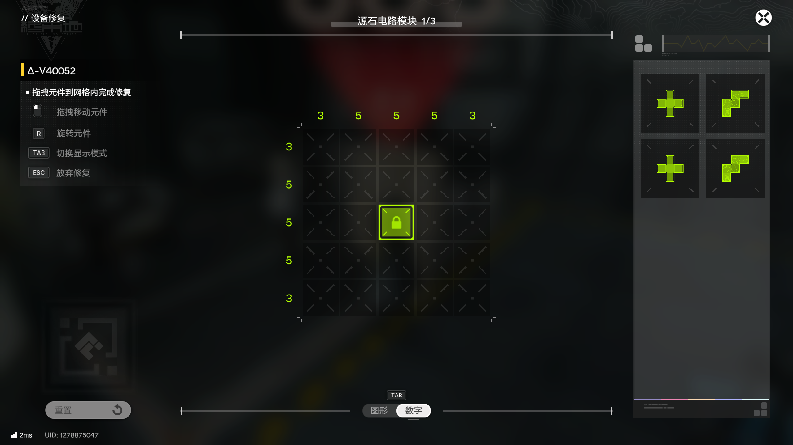
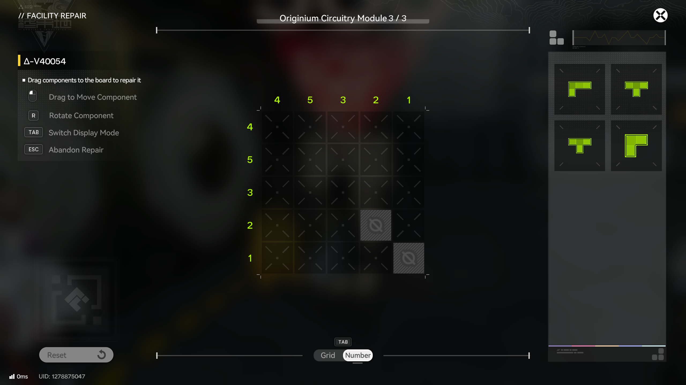

# OriginiumCircuitryPuzzleSolver

一款用于自动搜索游戏[《明日方舟：终末地》](https://endfield.hypergryph.com)中“源石电路：修复”谜题解决方案的工具。\
A tool to automatically finding the solution for the puzzle _Originium Circuitry: Repairs_ in game [_Arknights: Endfield_](https://endfield.gryphline.com/en-us).

考虑到谜题网格大小不会过大，所以采用暴力搜索方案。\
Considering that the puzzle grid size will not be too large, a brute-force search approach is adopted.

- [Example-1](#Example-1)
- [Example-2](#Example-2)

## Example-1



> ```
> Grid:
>   1 2 3 4 - column requirements
> 1 . . . .
> 2 . . . .
> 3 . . . .
> 4 . . . .
>  \
>   row requirements
>
> . - Empty
> * - Unavailable
> 0 - Occupied
> Set the grid:
> ```

```
.....
.....
..0..
.....
.....

```

> ```
> Set the column requirements:
> ```

```
3 5 5 5 3
```

> ```
> Set the row requirements:
> ```

```
3 5 5 5 3
```

> ```
> Add a component:
> ```

```
.0.
000
.0.

```

> ```
> Add a component:
> ```

```
.00
00.
0..

```

> ```
> Add a component:
> ```

```
.0.
000
.0.

```

> ```
> Add a component:
> ```

```
.00
00.
0..

```

> ```
> Add a component:
> ```

```

```

> ```
> Solution:
> .DDC.
> DDCCC
> DA0CB
> AAABB
> .ABB.
> ```

## Example-2



> ```
> Grid:
>   1 2 3 4 - column requirements
> 1 . . . .
> 2 . . . .
> 3 . . . .
> 4 . . . .
>  \
>   row requirements
>
> . - Empty
> * - Unavailable
> 0 - Occupied
> Set the grid:
> ```

```
.....
.....
.....
...*.
....*
```

> ```
> Set the column requirements:
> ```

```
4 5 3 2 1
```

> ```
> Set the row requirements:
> ```

```
4 5 3 2 1
```

> ```
> Add a component:
> ```

```
000
0..

```

> ```
> Add a component:
> ```

```
000
.0.

```

> ```
> Add a component:
> ```

```
000
.0.

```

> ```
> Add a component:
> ```

```
00
0.

```

> ```
> Add a component:
> ```

```

```

> ```
> Solution:
> AAAC.
> ABCCC
> BBB..
> DD.*.
> .D..*
> ```
